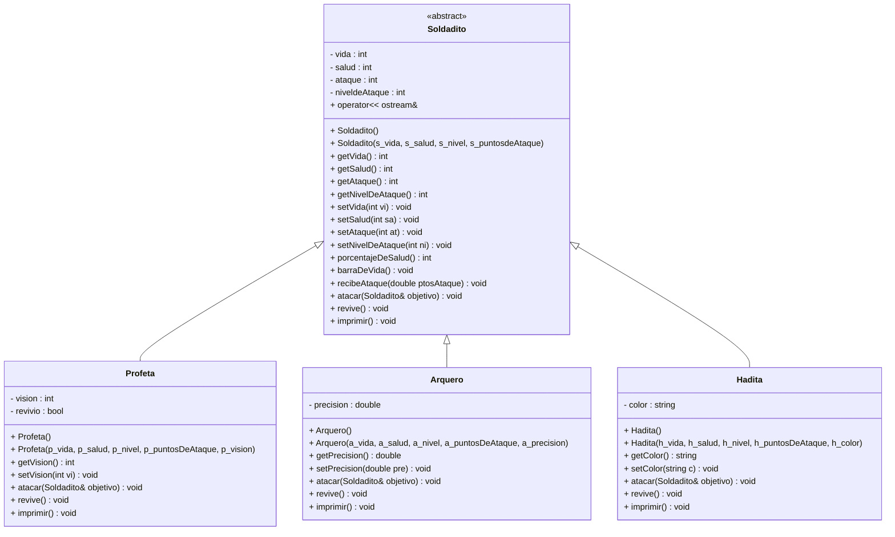

# Proyecto Final

**Nombre del autor:** Marbella Barba De los Santos
**Matricula:** A01660946

```mermaid
classDiagram
    Soldadito <|-- Profeta
    Soldadito <|-- Arquero
    Soldadito <|-- Hadita

      class Soldadito {
        <<abstract>>
        - vida : int
        - salud : int
        - ataque : int
        - niveldeAtaque : int
      }
      Soldadito: + Soldadito()
      Soldadito: + Soldadito(s_vida, s_salud, s_nivel, s_puntosdeAtaque)

      Soldadito: + getVida() int
      Soldadito: + getSalud() int
      Soldadito: + getAtaque() int
      Soldadito: + getNivelDeAtaque() int
      Soldadito: + setVida(int vi) void
      Soldadito: + setSalud(int sa) void 
      Soldadito: + setAtaque(int at) void 
      Soldadito: + setNivelDeAtaque(int ni) void 
      Soldadito: + porcentajeDeSalud() int
      Soldadito: + barraDeVida() void 
      Soldadito: + recibeAtaque(double ptosAtaque) void 
      Soldadito: + atacar(Soldadito& objetivo) void
      Soldadito: + revive() void 
      Soldadito: + imprimir() void  
      Soldadito: + operator<< ostream&
    
    class Profeta {
      - vision : int
      - revivio : bool 
      }
        Profeta : + Profeta()
        Profeta : + Profeta(p_vida, p_salud, p_nivel, p_puntosDeAtaque, p_vision)
        Profeta : + getVision() int
        Profeta : + setVision(int vi) void
        Profeta : + atacar(Soldadito& objetivo) void
        Profeta : + revive() void
        Profeta : + imprimir() void

    class Arquero {
      - precision : double
      }
        Arquero : + Arquero()
        Arquero : + Arquero(a_vida, a_salud, a_nivel, a_puntosDeAtaque, a_precision)
        Arquero : + getPrecision() double
        Arquero : + setPrecision(double pre) void
        Arquero : + atacar(Soldadito& objetivo) void
        Arquero : + revive() void
        Arquero : + imprimir() void
      
    class Hadita {
      - color : string
    }
        Hadita : + Hadita()
        Hadita : + Hadita(h_vida, h_salud, h_nivel, h_puntosDeAtaque, h_color)
        Hadita : + getColor() string
        Hadita : + setColor(string c) void
        Hadita : + atacar(Soldadito& objetivo) void
        Hadita : + revive() void
        Hadita : + imprimir() void
```

